# Responsive Web Site Layout

Greetings, Web Developers!

In this exercise, you will be writing the CSS to create the layout for a small, multi-page website. You'll be using width, float, and media queries to create a flexible, responsive one- and two-column layout.

### Setup

[Download the initial project files](https://github.com/barberboy/responsive-site/archive/master.zip), which will contain five .html files and a styles.css file.

### Step 1: Styling the Header

Unzip the project files and open 'index.html' in a web browser. You should see something that looks about like this:

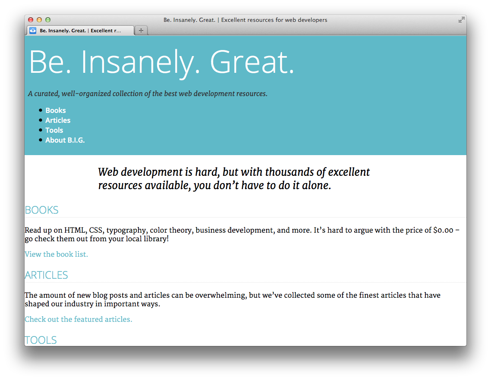

_Be. Insanely. Great._ is a website featuring a collection of books, articles, and web-based tools for amazing web developers such as yourself. Feel free to navigate around the site. You'll see that there are four pages in addition to the home page: Books, Articles, Tools, and About.

The website is clearly unfinished as far as styling goes. Our first step is to add a little styling for the header of the page.

Let's start by centering the text in the header. Open 'styles.css', and add the following styles at the bottom of the file:

<pre>header {  
 text-align: center;  
}</pre>

Take a look at it! I bet it looks a little bit better. Let's also make the navigation menu lay out in a horizontal row. To do that, remove the margin and padding from the unordered list, and make the list items 'display: inline-block':

<pre>header nav ul {  
 margin: 0;  
 padding: 0;  
}  
header nav li {  
 display: inline-block;  
 padding: 1em;  
}</pre>

Our header should look something like this now:

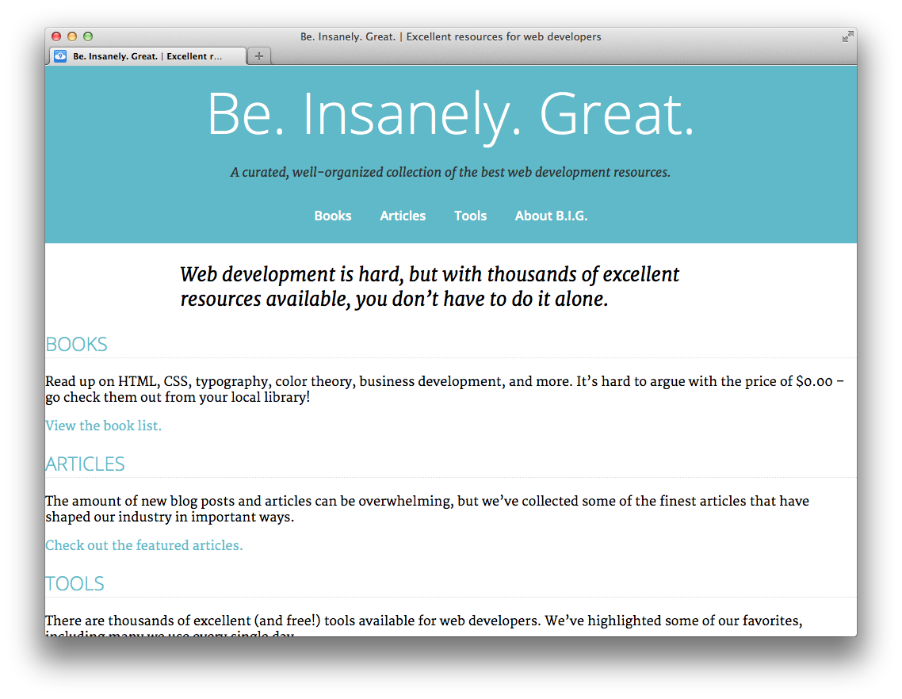

### Step 2: Setting a max-width for the page

Right now the content stretches all the way across the page which makes it very difficult to read. Let's set a max-width for the content, and also center it using 'margin: auto':

<pre>header .content,  
main .content,  
footer .content {  
 max-width: 50em;  
 margin: 0 auto;  
}</pre>

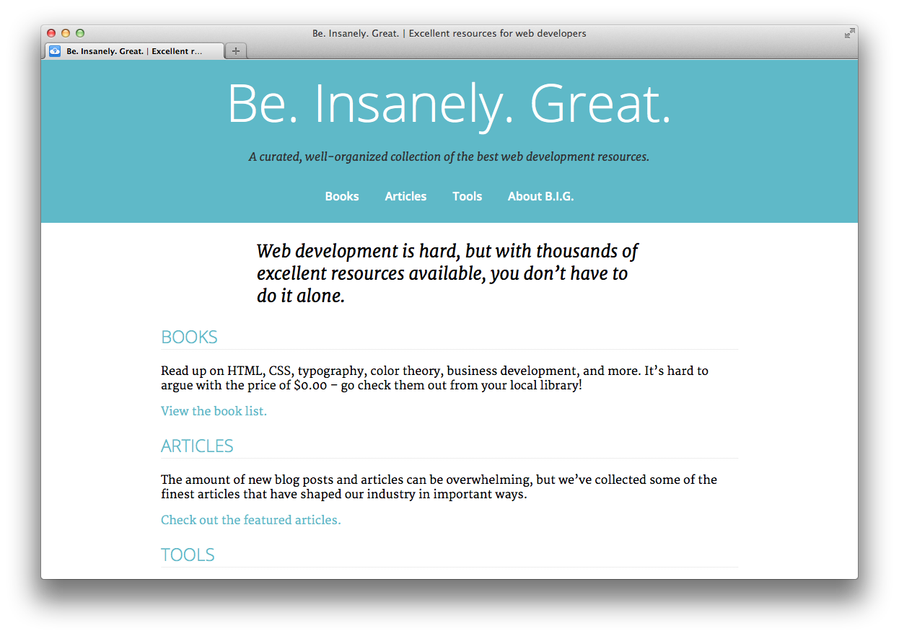

By the way, the reason we set the max-width for 'header .content' instead of just 'header' is so the background color for the header and footer would still stretch to the edge of the page.

### Step 3: Floating the "Features" boxes.

There isn't much content in the explanation for "Books", "Articles", and "Tools" on the homepage. Let's align them side-by-side in order to save some space. Add the following rules to 'styles.css':

<pre>.features section {  
 float: left;  
 width: 30%;  
 margin: 1em 1.6666666666667%;  
}</pre>

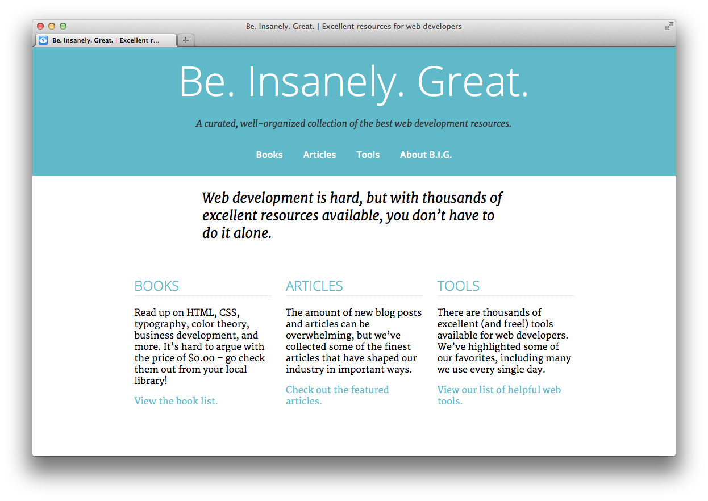

Hey, that looks so good! Let's also do that for the footer as well. Instead of rewriting all of those rules, let's just update the CSS selector from the last declaration so those styles also apply to the 'section' elements inside the footer:

<pre>.features section,  
footer section {  
 float: left;  
 width: 30%;  
 margin: 1em 1.6666666666667%;  
}</pre>

Hmm, it looks like we have a problem.

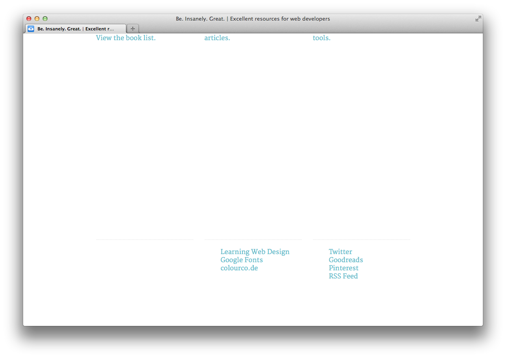

Since all of the elements in the footer are floated, the footer itself doesn't take up any height! We can fix this by setting 'overflow: auto' to the footer. We're also going to set it for the 'main' element just to be safe. Let's also set 'clear: both' for those elements to be sure that they flow *beneath* any other floated elements. Add these rules to 'styles.css':

<pre>main,  
footer {  
 clear: both;  
 overflow: auto;  
}</pre>

That should clear things up. The footer should look better now:

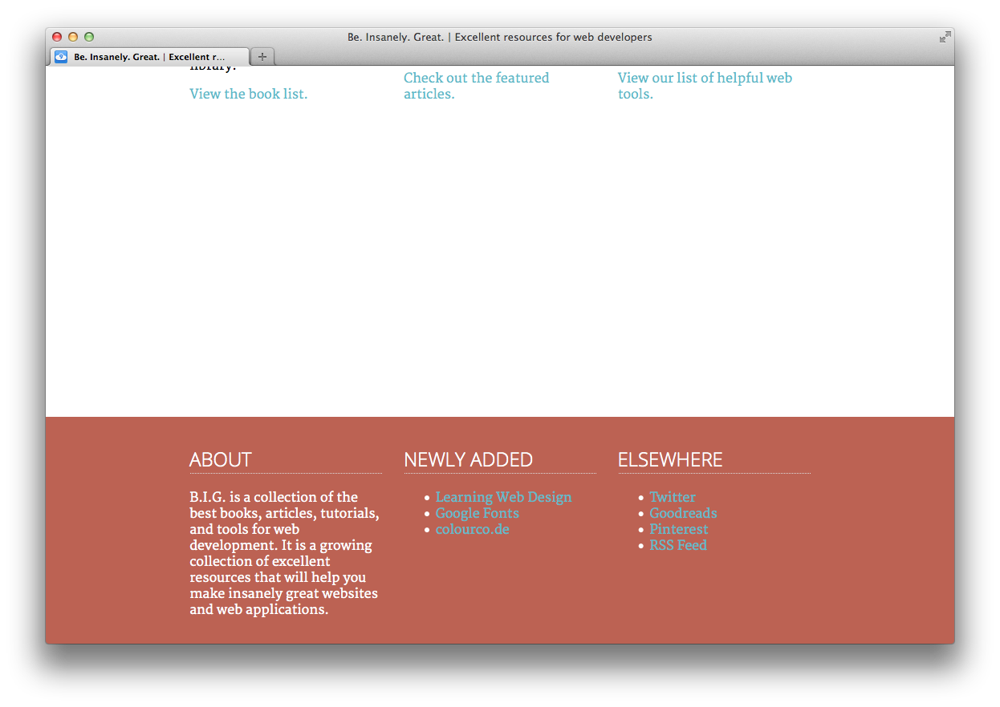

### Step 4: Two-Column Layout

The Books, Articles, and Tools pages have some additional content in an 'aside' element. We're going to update the layout for those pages to be two-columns instead of one.

If you edit articles.html, books.html, and tools.html, you can see that they have the class name 'two-column-layout' on the 'body' element. Let's go ahead and write some CSS that will only apply to those pages. Add these rules to 'styles.css':

<pre>/* two-column layout: */  
.two-column-layout article {  
 float: left;  
 width: 63.333333333%;  
 margin-right: 1.666666667%;  
 margin-left: 1.666666667%;  
}  
.two-column-layout aside {  
 float: left;  
 width: 30%;  
 margin-left: 1.666666667%;  
 margin-right: 1.666666667%;  
}</pre>

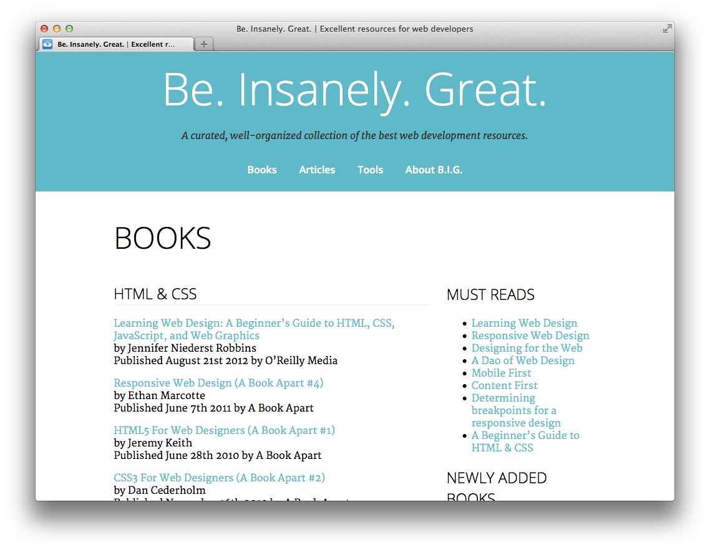

Wahoo!! We have two columns!

### Step 5: Make it Responsive

The layout is looking good, but things get a little cramped and hard to read when we resize to a smaller screen:

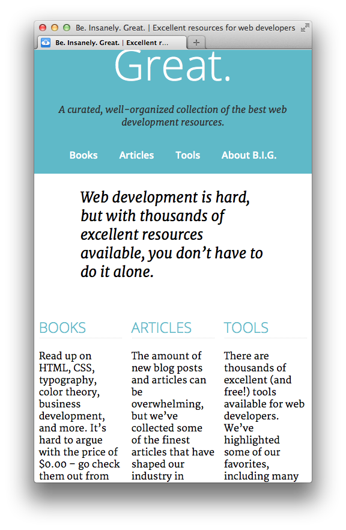

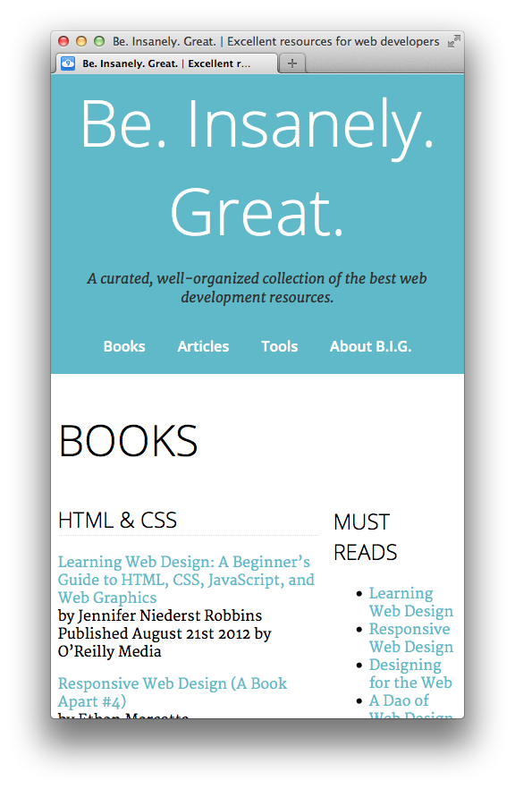

Let's add a media query that will undo our floats for narrower windows. Add this CSS at the end of 'styles.css':

<pre>/* responsive layout: */  
@media screen and (max-width: 40em) {  
    .features section,  
    footer section,  
    .two-column-layout article,  
    .two-column-layout aside {  
         float: none;  
         width: 96.6666666667%;  
    }  
}</pre>

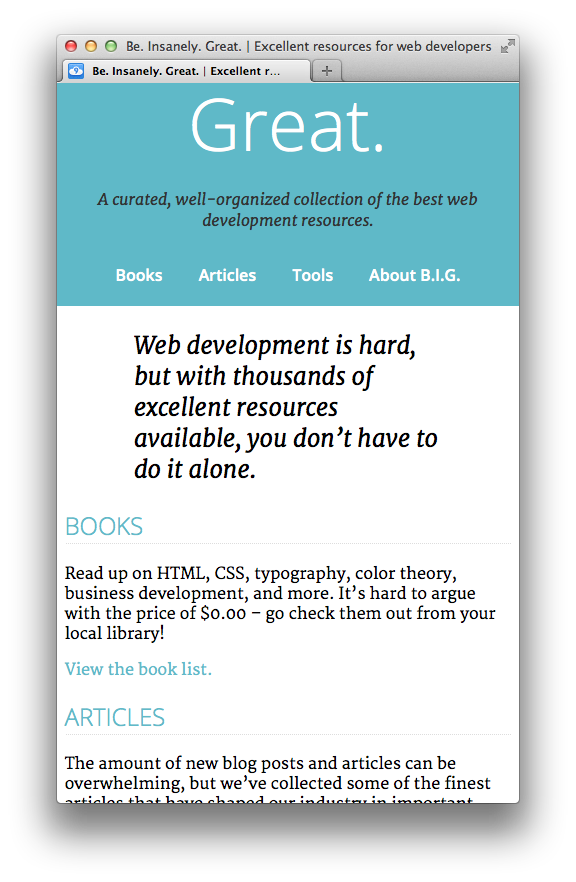

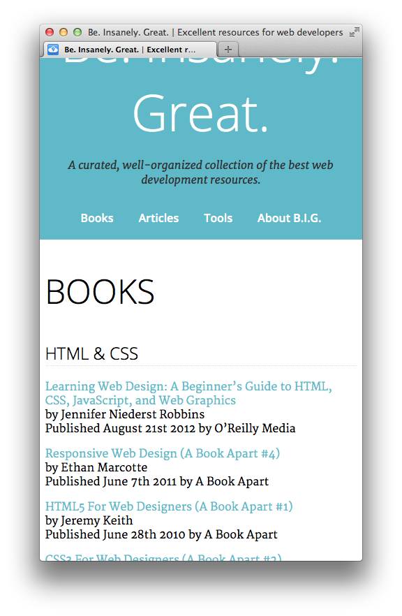

Ooh, that is better!

### Step 6: Add Viewport Meta Tag

This are looking pretty good now, but if you look at the page on a phone, you'll get a "zoomed-out" look, something like this:

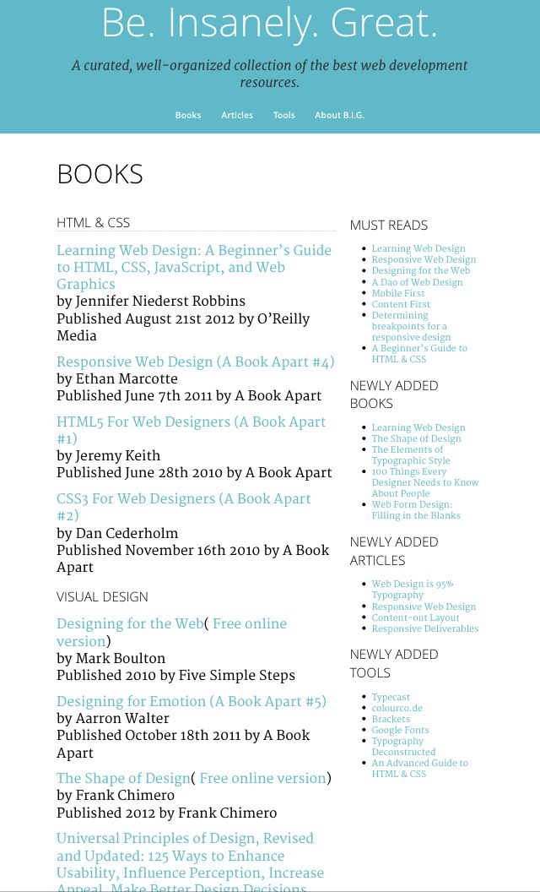

By default, mobile browsers like the iPhone set the viewport to be wide like a desktop browser. If we want our website to look at home on a mobile device, we need to add the "[Viewport Meta Tag](https://developer.apple.com/library/iOS/documentation/AppleApplications/Reference/SafariWebContent/UsingtheViewport/UsingtheViewport.html)".

The viewport meta tag goes inside the &lt;head&gt; element in the HTML files. Add the following meta element on a new line *before* the closing &lt;/head&gt; tag in **index.html, books.html, articles.html, tools.html, and about.html**:

    <meta name="viewport" content="width=device-width">

Now, the pages will look something like this on mobile devices:

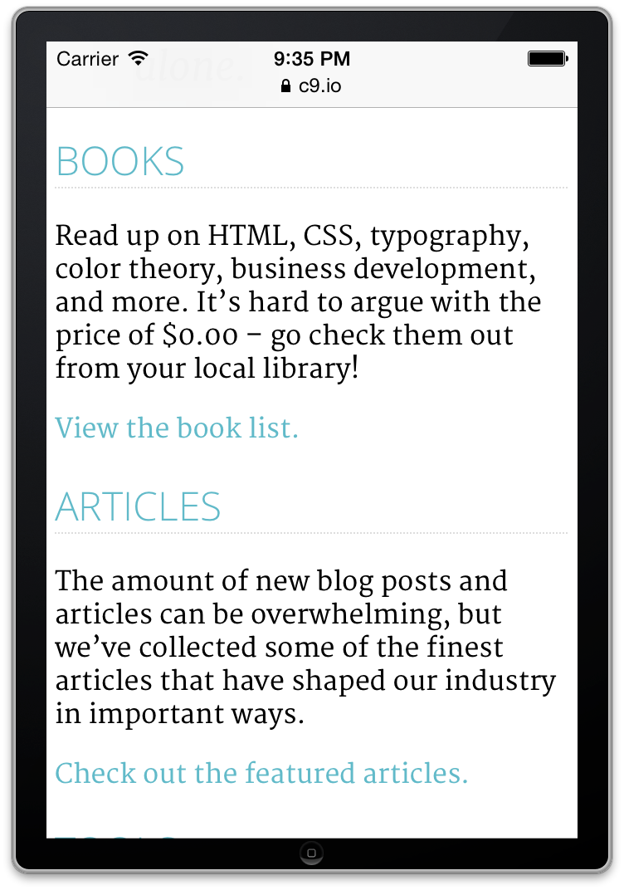

### Done!

That is it! After you've made your changes and tested, upload a .zip with the changes.
